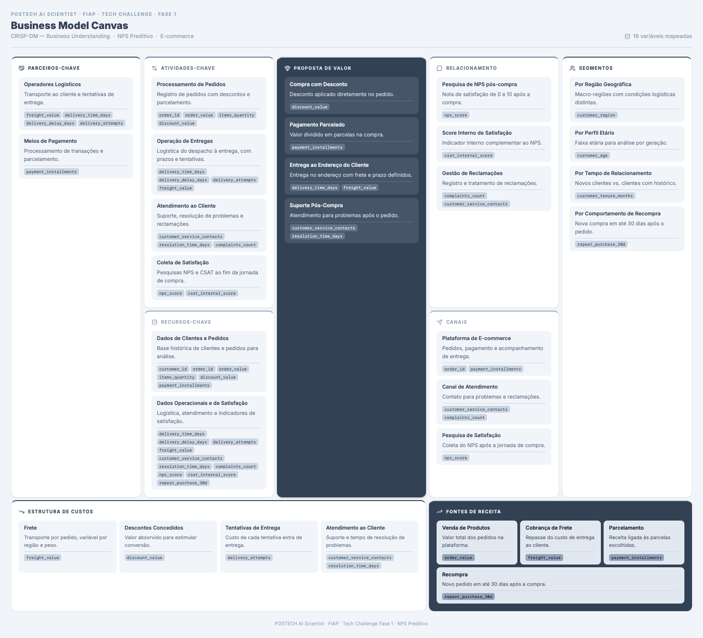

# 2. Business Canvas

*CRISP-DM: Business Understanding*

## Contexto

O case descreve um e-commerce em crescimento acelerado que enfrenta alta variabilidade no **Net Promoter Score (NPS)** entre diferentes perfis de clientes. O indicador é coletado apenas ao final da jornada de compra, o que impede ações preventivas. A empresa dispõe de dados operacionais de pedidos, logística e atendimento — mas não de informações sobre catálogo, marketing ou concorrência.

Este canvas foi construído **exclusivamente com base no que o case e as 19 variáveis do dataset permitem inferir**. Elementos típicos de um e-commerce (fornecedores, estoque, campanhas, app mobile etc.) foram omitidos quando não há evidência nos dados disponíveis.

---

## Visão geral do modelo

O canvas mapeia como a empresa gera valor na jornada de compra online: o cliente realiza um pedido com desconto e parcelamento, recebe a entrega no endereço e, quando necessário, aciona o suporte. Ao final, a empresa mede a satisfação via NPS e CSAT. Cada bloco do canvas está ancorado em variáveis observáveis no dataset, indicadas na imagem.

---

## Blocos do canvas

### Parceiros-chave

Inferidos a partir das variáveis logísticas e de pagamento:

- **Operadores logísticos** — responsáveis pelo transporte e pelas tentativas de entrega (`freight_value`, `delivery_time_days`, `delivery_delay_days`, `delivery_attempts`).
- **Meios de pagamento** — processam transações e habilitam o parcelamento (`payment_installments`).

Não há dados sobre fornecedores de produtos, gateways específicos ou transportadoras individuais.

### Atividades-chave

As operações centrais visíveis no dataset:

1. **Processamento de pedidos** — registro de valor, quantidade de itens, descontos e forma de pagamento (`order_id`, `order_value`, `items_quantity`, `discount_value`).
2. **Operação de entregas** — despacho, prazo, atrasos e tentativas de entrega (`delivery_time_days`, `delivery_delay_days`, `delivery_attempts`, `freight_value`).
3. **Atendimento ao cliente** — contatos, tempo de resolução e reclamações (`customer_service_contacts`, `resolution_time_days`, `complaints_count`).
4. **Coleta de satisfação** — pesquisa NPS e score interno de CSAT ao fim da jornada (`nps_score`, `csat_internal_score`).

### Proposta de valor

O que o cliente recebe, conforme os dados permitem identificar:

- **Compra com desconto** — redução aplicada diretamente no pedido (`discount_value`).
- **Pagamento parcelado** — flexibilidade financeira na compra (`payment_installments`).
- **Entrega ao endereço** — produto entregue com frete e prazo definidos (`delivery_time_days`, `freight_value`).
- **Suporte pós-compra** — canal para resolver problemas após o pedido (`customer_service_contacts`, `resolution_time_days`).

A qualidade do produto em si não é mensurada diretamente no dataset — apenas indiretamente, via satisfação e reclamações.

### Relacionamento com clientes

Três mecanismos de relacionamento identificáveis:

- **Pesquisa de NPS pós-compra** — nota de 0 a 10 coletada após a experiência (`nps_score`).
- **Score interno de satisfação** — indicador complementar ao NPS (`csat_internal_score`).
- **Gestão de reclamações** — registro e tratamento de insatisfações (`complaints_count`, `customer_service_contacts`).

### Segmentos de clientes

O dataset permite segmentar clientes por quatro dimensões:

| Segmento | Variável | Uso analítico |
|---|---|---|
| Região geográfica | `customer_region` | Condições logísticas distintas por macro-região |
| Perfil etário | `customer_age` | Análise por faixa etária / geração |
| Tempo de relacionamento | `customer_tenure_months` | Clientes novos vs. recorrentes |
| Comportamento de recompra | `repeat_purchase_30d` | Retenção em até 30 dias após o pedido |

O case menciona que o NPS varia entre perfis — essas variáveis são o ponto de partida para investigar essa variabilidade.

### Recursos-chave

Dois ativos de dados sustentam a operação e a análise:

- **Dados de clientes e pedidos** — identificação, valor, itens, desconto e parcelamento (`customer_id`, `order_id`, `order_value`, `items_quantity`, `discount_value`, `payment_installments`).
- **Dados operacionais e de satisfação** — logística, atendimento e indicadores de experiência (demais variáveis do dataset).

### Canais

Três canais inferidos, sem detalhamento de plataforma (web vs. app):

- **Plataforma de e-commerce** — onde o pedido é realizado e o pagamento processado (`order_id`, `payment_installments`).
- **Canal de atendimento** — contato para problemas e reclamações (`customer_service_contacts`, `complaints_count`).
- **Pesquisa de satisfação** — coleta do NPS após a jornada (`nps_score`).

### Estrutura de custos

Custos identificáveis a partir das variáveis operacionais:

- **Frete** — transporte por pedido, variável por região (`freight_value`).
- **Descontos concedidos** — valor absorvido para estimular conversão (`discount_value`).
- **Tentativas de entrega** — custo de cada tentativa extra (`delivery_attempts`).
- **Atendimento ao cliente** — suporte e tempo de resolução (`customer_service_contacts`, `resolution_time_days`).

Custos de aquisição, estoque e infraestrutura de TI não estão no dataset.

### Fontes de receita

Quatro fontes inferíveis:

- **Venda de produtos** — valor total dos pedidos (`order_value`).
- **Cobrança de frete** — repasse parcial ou total do custo de entrega (`freight_value`).
- **Parcelamento** — receita associada às condições de pagamento (`payment_installments`).
- **Recompra** — indicador de retorno do cliente em até 30 dias (`repeat_purchase_30d`).

---

## Conexão com o desafio

O canvas evidencia que a jornada do cliente cruza **três frentes operacionais** — pedido, logística e atendimento — antes da coleta do NPS. Essa estrutura responde à pergunta central do case: *quais fatores operacionais influenciam a satisfação e como agir de forma proativa?*

As variáveis de logística (`delivery_delay_days`, `delivery_attempts`) e atendimento (`complaints_count`, `resolution_time_days`) são candidatas naturais a explicar variações no NPS — hipótese que será testada na [Análise e Hipóteses](analise-hipoteses.md) e na [EDA](eda.md).

## Da previsão de NPS para a previsão de entrega

O canvas também ajuda a explicar a mudança de foco da solução. A pesquisa de NPS aparece no fim da jornada, depois que a promessa de entrega já foi cumprida ou quebrada. Logo, prever a nota de NPS apenas no fim do processo teria pouco valor operacional se a empresa não conseguir agir antes.

A EDA mostrou que a principal alavanca está na atividade-chave de **operação de entregas**. Por isso, a proposta final desloca a modelagem para um ponto anterior da jornada:

| Ponto da jornada | Leitura inicial | Leitura após a EDA |
|---|---|---|
| Coleta de satisfação | Prever `nps_score` | Medir impacto final da experiência |
| Operação logística | Variável explicativa | Alvo operacional da solução |
| Prazo prometido | Contexto de entrega | Promessa que precisa ser calibrada |
| Atendimento | Reação ao problema | Sinal de que a degradação já aconteceu |

Com essa leitura, o NPS continua essencial, mas como indicador de resultado. A solução prática é melhorar a previsão de prazo e o gerenciamento de atrasos para impedir que o cliente chegue ao ponto de virar detrator.

---

## Limitações do mapeamento

Por depender apenas do case e do dataset, este canvas **não representa o negócio completo**. Em particular:

- Não há informações sobre **catálogo, precificação competitiva ou mix de produtos**.
- **Marketing e aquisição** de clientes não são mensurados.
- Parceiros e canais foram **generalizados** (ex.: "operadores logísticos" em vez de transportadoras nomeadas).
- A relação entre custos e receitas é **inferida**, não calculada — o dataset registra valores por pedido, não demonstrativos financeiros.

Essas lacunas serão consideradas ao interpretar os resultados da análise e ao formular recomendações.
